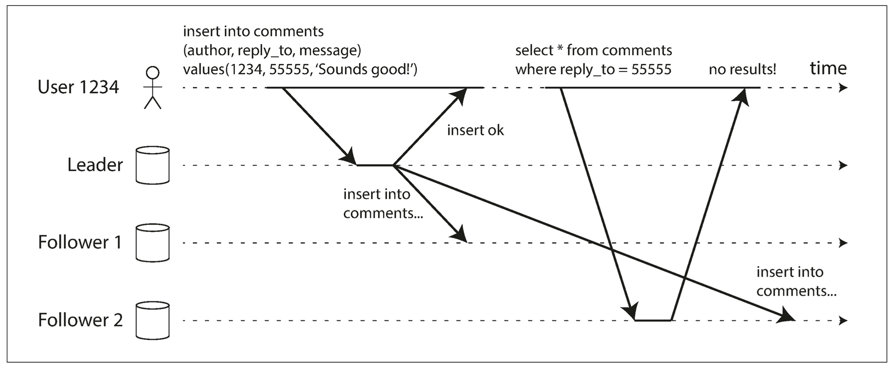

# 读己之写（Read-your-writes）一致性详解

## 1. 原问题
**下图是用户写入后从旧副本中读取数据。**
**(1) 这种读写方式存在什么问题？**
**(2) 应提供哪种一致性以解决上述问题，如何实现这种一致性，试列举方案。**

---

## 2. 相关考点
在分布式数据库及系统设计的面试中，该图表展示的是典型的**异步复制（Asynchronous Replication）**带来的问题，核心考点包括：
* **主从复制延迟（Replication Lag）**：数据从Leader同步到Follower需要时间。
* **一致性模型**：区分强一致性、最终一致性与**客户端中心的一致性（Client-centric Consistency）**。
* **读写分离策略**：如何在读写分离架构下保证用户体验。
* **分布式时钟与版本控制**：如何利用时间戳或LSN（Log Sequence Number）来判断数据新鲜度。

---

## 3. 核心知识点讲解

### 3.1 问题分析：读不到自己刚写的数据
从图中可以看出：
1.  **过程**：User 1234 向 Leader 写入了一条评论。Leader 写入成功并立即返回 "insert ok"。此时，数据尚未同步到 Follower 2。
2.  **现象**：User 1234 紧接着发起查询，请求被负载均衡到了 Follower 2。
3.  **结果**：由于 Follower 2 存在延迟（Replication Lag），它还没有收到那条评论数据，因此返回 "no results!"。
4.  **问题定义**：这违反了用户的直觉——“我刚才明明提交成功了，为什么看不见？”。这种现象称为**写后读不一致（Read-after-write Inconsistency）**。

### 3.2 解决方案：读己之写一致性 (Read-your-writes Consistency)
为了解决这个问题，我们需要保证**读己之写一致性**。
**定义**：这是一个**以客户端为中心**的一致性模型。它保证如果一个用户修改了数据项，那么该用户之后的所有读操作都必须能读取到那个更新（或者更新的值）。*注意：这并不要求其他用户也能立刻看到，只要求修改者本人能立刻看到。*

### 3.3 实现方案
实现读己之写一致性的常见策略有以下几种：

#### 方案一：基于内容的路由 (读写分离优化)
* **规则**：
    * 如果用户访问的是**自己的个人资料/数据**（如“我的订单”、“我的评论”），强制路由到 **Leader** 节点读取。
    * 如果用户访问的是**他人的数据**（如“查看别人的主页”），则路由到 **Follower** 节点。
* **优缺点**：实现简单，但如果业务大部分是读自己的数据（如社交网络发帖后看Feed流），Leader 压力会很大，丧失了读写分离的优势。

#### 方案二：基于时间的路由 (Monotonic Logic)
* **规则**：
    * 客户端记录自己上一次写入的时间戳（Last Write Timestamp, $T_{write}$）。
    * 当客户端发起读请求时，携带 $T_{write}$。
    * 系统（或中间件）检查被选中的 Follower 的最新同步时间 $T_{replica}$。
    * 如果 $T_{replica} < T_{write}$，说明该 Follower 落后，则**阻塞等待**直到追上，或者将请求**重路由**到 Leader（或其他够新的 Follower）。
* **优缺点**：逻辑精准，利用了从节点资源。但需要客户端维护状态或在Session中维护。

#### 方案三：客户端单调读 (Sticky Session)
* **规则**：
    * 同一个用户的请求总是路由到同一个特定的副本节点。
* **优缺点**：这只能保证“单调读”，并不能完全保证“读己之写”（因为那个特定的副本可能还没同步到Leader的数据）。这通常作为一种辅助手段，不能单独完全解决图中的问题，除非配合方案二使用。

---

## 4. 类似题目

1.  **题目一**：什么是**单调读一致性（Monotonic Reads）**？它解决了什么场景下的问题？与读己之写有何区别？
2.  **题目二**：在跨地域（Cross-Region）数据同步的场景下，如何保证用户切库（从美国机房切换到欧洲机房）后的数据一致性？
3.  **题目三**：Amazon Dynamo 论文中提到的 **W + R > N** 公式（Quorum 机制）能否解决图中的问题？代价是什么？

---

## 5. 对应的答案

### 答案一：单调读一致性
* **场景**：用户先刷新了一次，看到了新文章；再刷新一次（请求打到了更旧的副本），新文章消失了。这叫“时光倒流”。
* **单调读**：保证如果一个用户读取到了数据的某个版本，后续的读取绝不会看到比该版本更旧的数据。
* **区别**：**读己之写**关注的是“我写的我能看到”；**单调读**关注的是“我看过的不会消失”。图中的问题主要由读己之写解决，但单调读也是提升体验的重要一环。

### 答案二：跨地域同步的一致性
* 这是**读己之写**的扩展场景。
* **方案**：当用户在 Region A 更新数据后，更新会附带一个全局版本号或时间戳。当用户漫游到 Region B 读取时，Region B 的网关会检查本地数据的版本。如果本地版本落后于用户的版本，Region B 会阻塞请求，等待从 Region A 同步数据，或者直接透传请求去 Region A 读取（虽然延迟高，但保证一致）。

### 答案三：Quorum 机制
* **能否解决**：**能**。
* **原理**：如果设置 $W + R > N$（例如 $N=3, W=3, R=1$ 或 $W=2, R=2$），则读取操作必定会命中至少一个拥有最新数据的节点。
* **代价**：牺牲了**可用性（Availability）**和**延迟（Latency）**。在图中的场景（异步复制）通常是为了高性能，强行上 Quorum 会导致写操作变慢（因为要等副本确认），或者读操作变慢（因为要读多个副本进行比对）。这通常不符合互联网高并发业务的需求。

# 写后读旧副本：问题与一致性方案

## 1. 原问题
**下图是用户写入后从旧副本中读取数据。**  
（1）这种读写方式存在什么问题？  
（2）应提供哪种一致性以解决上述问题，如何实现这种一致性，试列举方案。

---

## 2. 相关考点
- **主从复制/Leader-Follower 复制延迟（replication lag）**
- **一致性模型与会话保证（Session Guarantees）**
  - Read-your-writes（读己之写 / 写后读一致）
  - Monotonic reads（单调读）
  - Causal consistency（因果一致性）
  - Linearizability（线性一致性/强一致）
- **读写路由策略**：读主、读从、粘滞会话、读修复
- **位点/版本机制**：LSN/GTID/offset、commit position、依赖标记
- **Quorum 读写**：R/W/N 配置与 R+W>N 的思想
- **工程权衡**：延迟、可用性、吞吐、跨地域网络成本

---

## 3. 核心知识点讲解

### 3.1（1）这种读写方式存在什么问题？
该模式本质是：**写入到 Leader 成功返回，但读请求被路由到了落后的 Follower（旧副本）**，导致用户读不到自己刚写的数据。

主要问题：
1. **写后读不一致（Read-after-write inconsistency）/ 读己之写被破坏**
   - 用户写入成功后立刻查询，却返回“查不到/无结果/旧值”，体验与语义都不符合直觉。
2. **会话一致性被破坏（Session anomaly）**
   - 同一个用户会话中先写后读，读到的是更旧的状态，可能出现：
     - “我刚评论了，为什么看不到？”
     - “我刚提交了配置，为什么查询还显示旧配置？”
3. **业务层可能出现逻辑错误**
   - 典型如：写入后读取做下一步决策（幂等校验、扣减、去重、风控判断），读到旧数据可能导致：
     - 重复提交/重复下单
     - 幂等失效
     - 误判状态，产生补偿/对账复杂度上升
4. **根因**
   - **异步复制或复制传播延迟** + **读从库策略** ⇒ follower 尚未应用该写入。

> 一句话：这是典型的“写已确认，但读走旧副本”的一致性缺口。

---

### 3.2（2）应提供哪种一致性来解决？如何实现？（列举方案）

#### 3.2.1 推荐的一致性目标：会话级“读己之写”（Read-your-writes）
要解决图中的问题，最直接的目标是提供 **Read-your-writes（RYW）一致性**：
- **同一客户端/同一会话在写入成功后，后续读取必须至少能看到该写入效果**。

这通常不要求全局强一致（对所有用户都立刻可见），但要求“对写入者本人立刻可见”，成本更可控。

在更严格的业务里（例如支付/库存强约束），可以提升到 **线性一致性（强一致）**，但代价更高。

---

#### 3.2.2 实现方案（从易到难、从常见到更强）

##### 方案A：写后读主（Read from Leader / Primary）
- **做法**：写入后的一段时间内（或同一会话内）强制读 Leader。
- **优点**：语义简单，几乎必然满足 RYW。
- **缺点**：Leader 读压力上升；跨地域场景读延迟可能更高。
- **适用**：写后立即展示（评论、发帖、配置生效确认）、强一致读需求路径。

---

##### 方案B：会话粘滞（Sticky Session / Same Replica Affinity）
- **做法**：同一用户会话的读请求固定路由到同一个副本（或固定到 Leader）。
- **优点**：实现较简单；可减少在副本间“来回读导致越读越旧”的问题。
- **缺点**：若粘到落后副本仍可能读不到最新（除非粘到 Leader 或结合位点等待）；副本故障时需要重新粘滞策略。
- **适用**：长会话的产品体验（用户中心、个人页、控制台）。

---

##### 方案C：位点令牌（Position Token / LSN/GTID/Offset）+ 读前追平（Read-after-write with wait）
- **做法**：
  1. 写入返回时，Leader 同时返回一个**提交位点**（如 LSN/GTID/日志offset/commit index）。
  2. 客户端在后续读请求中携带该位点（或由网关/会话层保存）。
  3. 读路由到某个副本时，若该副本 **apply 位点 < 需要的位点**，则：
     - 等待该副本追到该位点（阻塞到达/超时降级），或
     - 改路由到已追平的副本/Leader。
- **优点**：在读从库的同时仍能提供 RYW；对Leader压力较小。
- **缺点**：实现复杂；可能增加尾延迟（等追平）；需要副本暴露复制进度。
- **适用**：大规模读从架构，希望“尽量读从但不破坏写后读体验”的系统。

---

##### 方案D：Quorum 读写（Read/Write Quorum）
- **做法**：设置副本数 N、写确认 W、读确认 R，使得 **R + W > N**，读时从多个副本取值并以最新/多数规则决定结果。
- **优点**：可提升读到最新提交值的概率与一致性强度（视实现与失败模型）。
- **缺点**：读写都更慢；实现复杂；对网络分区敏感；并非所有系统都支持。
- **适用**：分布式KV/NoSQL（可配置一致性级别的系统）与需要更强一致性的读路径。

---

##### 方案E：同步/半同步复制（提高写入提交门槛）
- **做法**：写入成功返回前，要求至少一个/多数副本已经收到并（视策略）落盘或应用。
- **优点**：显著缩小“写已确认但副本落后”的窗口。
- **缺点**：写延迟上升；副本故障/分区时可用性下降（取决于确认策略）。
- **适用**：RPO要求较高、可接受更高写延迟的核心数据。

---

##### 方案F：提升到强一致读写（线性一致性）
- **做法**：所有读写都走共识/Leader提交路径（或严格的多数派协议），保证写完成后任何读都看到最新。
- **优点**：语义最强，彻底避免此类异常。
- **缺点**：成本最高（延迟、吞吐、可用性在分区时的取舍）。
- **适用**：金融级别、强约束状态机、不可接受旧读的关键业务。

---

### 3.3 选型建议（答题加分）
- **只为解决图中“用户自己看不到自己刚写的数据”**：优先选择 **会话一致性/读己之写（RYW）**，落地常用 **A（写后读主）** 或 **C（位点令牌+追平）**。
- **若业务要求所有用户都立刻看到最新**：考虑 **强一致（线性一致）** 或更严格的 Quorum/同步复制，但明确说明代价。

---

## 4. 类似题目
1. **题目一**：读从库会产生哪些一致性异常？除写后读不一致外再举两种，并说明原因。
2. **题目二**：什么是“单调读（Monotonic Reads）”？它与“读己之写（RYW）”有什么区别？
3. **题目三**：如果是跨地域多活架构（多Region），如何实现“写后读一致”同时控制延迟？给出两种方案。

---

## 5. 对应的答案

### 答案一：读从库的常见一致性异常
- **写后读不一致（RYW被破坏）**：写入后立刻读，从库未追平导致读不到。
- **单调读被破坏**：用户先读到新值，随后请求被路由到更落后的副本又读到旧值（“越读越旧”）。
- **读到不一致视图**：同一时间不同副本返回不同结果（副本间延迟/分区导致）。

---

### 答案二：单调读 vs 读己之写
- **单调读（Monotonic Reads）**：同一客户端后续读取不会比之前读取更旧（保证“读进度不回退”）。
- **读己之写（RYW）**：同一客户端写入成功后，后续读取必须能看到自己的写入。
- **区别**：
  - 单调读关注“读序列不回退”，不一定覆盖“写后必可见”；
  - RYW关注“写对自己可见”，不一定保证跨多次读不回退（实际常组合提供会话一致性）。

---

### 答案三：跨地域多活下实现写后读一致的两种方案
1. **读本地主 + 异地最终一致**
   - 写入落在本地Leader；写后读强制走本地Leader或本地已追平副本，保证用户体验；异地通过异步复制最终收敛。
2. **位点令牌 + 最近副本追平/路由**
   - 写返回携带位点；读请求携带位点，网关选择“已达到位点”的最近副本，否则等待追平或回退读Leader（控制延迟与一致性）。
