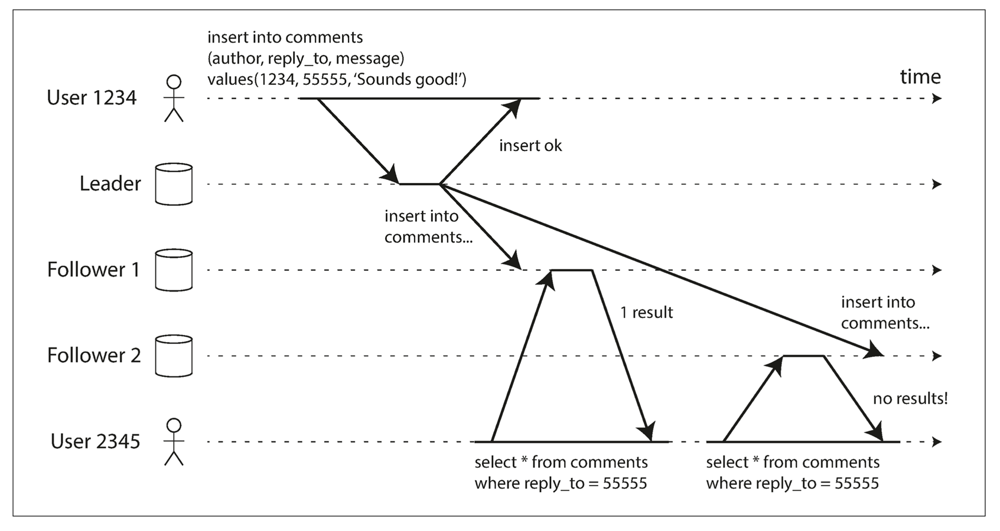

# 单调读（Monotonic Reads）一致性详解

## 1. 原问题
**下图用户首先从新副本读取，然后从旧副本读取。**
**(1) 这种读写方式存在什么问题？**
**(2) 应提供哪种一致性以解决上述问题，如何实现这种一致性？试举例说明。**

---

## 2. 相关考点
在分布式系统与一致性模型的面试中，该场景考察的是**客户端一致性（Client-centric Consistency）**的细分模型，核心考点包括：
* **单调读（Monotonic Reads）**：一致性模型定义。
* **时光倒流（Time-travel anomaly）**：用户体验上的数据回滚现象。
* **负载均衡策略**：轮询（Round Robin）与哈希（Source Hashing）对一致性的影响。
* **会话状态管理**：如何在无状态的HTTP请求中维护因果关系。

---

## 3. 核心知识点讲解

### 3.1 问题分析：时光倒流 (Time Travel)
从图 `image_5eaff4.png` 中可以看出：
1.  **场景**：User 2345（非数据写入者）发起了两次查询。
2.  **第一次查询**：请求路由到了 **Follower 1**。此时 Follower 1 已经同步了 Leader 的数据，因此用户看到了 "1 result"（例如看到了一条新评论）。
3.  **第二次查询**：用户刷新页面，请求被负载均衡路由到了 **Follower 2**。
4.  **现象**：Follower 2 存在延迟，尚未收到数据，因此返回 "no results!"。
5.  **问题**：用户明明刚才看到了数据，刷新后却消失了。这就像**时间倒流**了一样。这种不一致性会让用户感到困惑，认为系统不稳定或数据丢失。

### 3.2 解决方案：单调读一致性 (Monotonic Reads)
为了解决这个问题，需要保证**单调读一致性**。

* **定义**：如果一个进程读取到了数据 $x$ 的某个版本 $V$，那么该进程后续对 $x$ 的所有读取操作，都必须读取到版本 $V$ 或比 $V$ 更新的版本，绝不能读取到比 $V$ 更旧的版本。
* **通俗理解**：用户读到的数据流必须是**单调向前**的，不能回退。

### 3.3 实现方案

#### 方案一：基于用户ID的哈希路由 (Sticky Session / Source Hashing)
这是最简单且常用的工程实现方式。
* **机制**：负载均衡器（Load Balancer）在分发请求时，不使用随机或轮询算法，而是根据**用户ID（User ID）**或**会话ID（Session ID）**计算哈希值。
    * 公式：$Node = hash(UserID) \pmod N$
* **效果**：保证同一个用户的所有读请求都固定路由到同一个副本节点（例如始终是 Follower 1）。只要该节点不宕机，用户看到的数据就是单调递增的。
* **缺点**：若该节点负载过高或宕机，用户切换到新节点时仍可能遇到旧数据（需配合方案二缓解）。

#### 方案二：基于时间戳的检查 (Last Read Timestamp)
* **机制**：
    1.  客户端在每次读取数据时，记录下当前读到的数据的时间戳（或版本号），记为 $T_{last\_read}$。
    2.  当客户端发起下一次读取时，请求中携带 $T_{last\_read}$。
    3.  副本节点收到请求后，检查自己的最新同步时间 $T_{replica}$。
    4.  **判断**：
        * 若 $T_{replica} \ge T_{last\_read}$：数据够新，直接返回。
        * 若 $T_{replica} < T_{last\_read}$：数据太旧，副本需要阻塞等待同步，或者拒绝请求让客户端重试其他节点。
* **举例**：Web应用中，服务器返回数据的同时返回一个 `Last-Modified` 时间戳，浏览器下次请求通过 `If-Modified-Since` 或自定义Header带上这个时间。

---

## 4. 类似题目

1.  **题目一**：**单调读（Monotonic Reads）**和**单调写（Monotonic Writes）**有什么区别？
2.  **题目二**：在多设备场景下（用户在手机上看完，马上用电脑看），**基于源IP的哈希路由**还能保证单调读吗？为什么？
3.  **题目三**：什么是**一致性前缀读（Consistent Prefix Reads）**？它解决的是什么场景下的问题？

---

## 5. 对应的答案

### 答案一：单调读 vs 单调写
* **单调读**：关注**读取顺序**。保证用户不会看到“旧数据复活”。
    * *场景*：刷新页面，评论没消失。
* **单调写**：关注**写入顺序**。保证来自同一个系统的写操作，是按照顺序被执行的。
    * *场景*：我先创建了订单，然后支付了订单。系统不能先处理支付（发现没订单报错），再处理创建订单。单调写保证了因果操作的顺序性。

### 答案二：多设备场景下的路由失效
* **不能保证**。
* **原因**：基于源IP或User-Agent的哈希路由，只能保证**同一个设备**的请求打到同一个节点。
* **场景**：
    1.  手机（4G网络）访问，路由到 Follower 1（新数据）。
    2.  电脑（WiFi网络）访问，IP不同，路由到 Follower 2（旧数据）。
* **解决**：必须使用**基于用户账号（User ID）**的一致性哈希，或者在应用层实现基于时间戳的检查机制（方案二），因为时间戳可以跨设备传递（如果状态存在服务端Session中）。

### 答案三：一致性前缀读
* **定义**：保证用户看到的**一系列写入操作的顺序**与它们实际发生的顺序一致。
* **解决的问题**：**因果倒置**。
* **场景**：
    * 写入顺序：A 发送 "瓜很大"，B 回复 "确实大"。
    * 如果没有一致性前缀（例如基于分片的数据库，不同分片同步速度不同），观察者C可能先看到 B 的 "确实大"，后看到 A 的 "瓜很大"，导致对话逻辑混乱。
* **实现**：通常用于分片（Sharded）存储系统，确保相关联的分片按一致的顺序同步数据。

# 先读新副本再读旧副本：问题与一致性方案

## 1. 原问题
**下图用户首先从新副本读取，然后从旧副本读取。**  
（1）这种读写方式存在什么问题？  
（2）应提供哪种一致性以解决上述问题，如何实现这种一致性？试举例说明。

---

## 2. 相关考点
- **主从/多副本复制延迟（replication lag）**与读写分离
- **会话一致性（Session Consistency）/ 会话保证（Session Guarantees）**
  - **单调读（Monotonic Reads）**
  - Read-your-writes（读己之写）
  - 因果一致性（Causal Consistency）
- **读路由策略**：读主、读从、就近读、负载均衡与粘滞（sticky）
- **版本/位点机制**：LSN/GTID/offset/commit index、依赖标记（dependency）
- **工程权衡**：延迟、吞吐、可用性、跨地域成本、尾延迟

---

## 3. 核心知识点讲解

### 3.1（1）这种读写方式存在什么问题？
该场景表现为：**同一用户（或同一会话）先从较新的副本读到了结果（例如 1 条评论），随后请求被路由到较旧的副本却读不到（no results）**。

这类问题通常称为：
- **单调读被破坏（Monotonic Reads Violation）**
- 也常被描述为：**读回退 / 时间倒流（read regression / time-travel reads）**

具体危害：
1. **用户体验不一致**
   - 同一个用户刷新/翻页/重复查询，结果“忽有忽无”，严重降低可信度。
2. **会话内状态机/业务逻辑错误**
   - 若后续步骤依赖“我刚刚看到的数据”，读回退可能导致：
     - 重复操作（重复评论/重复提交）
     - 条件判断错误（误以为数据不存在）
3. **根因**
   - **副本间复制进度不同** + **读请求随机/就近路由到不同副本**  
   - 先命中新副本（已应用写入），后命中旧副本（尚未应用），导致会话内可见性倒退。

> 关键点：这与“写后读不一致（读己之写）”不同。本题即使是纯读（没有当前用户写），也会发生“先读到新、后读到旧”的回退问题。

---

### 3.2（2）应提供哪种一致性以解决？如何实现？举例说明

#### 3.2.1 应提供的一致性：**单调读一致性（Monotonic Reads）**
**定义（面试可直接背诵）**：  
> 对同一客户端/同一会话而言，后续读取到的数据版本不能比之前读取到的更旧；即“读进度不回退”。

它能精准解决本图问题：**一旦用户已经读到“包含该评论”的状态，之后无论路由到哪个副本，都不允许再读到“不包含该评论”的更旧状态。**

---

#### 3.2.2 实现方案（常见可落地做法）

##### 方案A：会话粘滞到同一副本（Sticky Session / Replica Affinity）
- **做法**：同一用户会话（cookie/session/token维度）在一段时间内固定路由到同一个副本（例如第一次读到Follower1，后续也一直读Follower1）。
- **为何有效**：避免“跨副本跳转”，自然降低读回退概率。
- **局限**：若固定的副本本身落后，仍可能一直读旧；副本故障需要迁移粘滞策略。

**举例**：  
User2345 第一次查询命中 Follower1（看到了 1 条结果），系统将 `session -> follower1` 绑定；下一次查询仍路由到 Follower1，因此不会出现第二次读到 no results。

---

##### 方案B：版本/位点令牌（LSN/GTID Token）+ 读前追平或重路由（Read Fence）
这是最标准、最“工程完备”的实现单调读方式。

- **核心思路**：让客户端（或网关）携带“我已经读到的最新版本下界”，后续读取必须满足该下界。
- **步骤**：
  1. 副本对外暴露自己的复制进度：例如 `applied_lsn`。
  2. 第一次读返回结果时，同时返回一个令牌：`read_lsn = follower1.applied_lsn`。
  3. 客户端后续读请求携带：`min_lsn = read_lsn`（或网关在会话中保存）。
  4. 路由到某副本时：
     - 若 `replica.applied_lsn >= min_lsn`：直接读并返回；
     - 否则：**等待该副本追平**（阻塞到追平或超时），或 **改路由到已追平的副本/Leader**。

**举例（对应图）**：  
- 第一次读命中 Follower1，返回 `1 result`，同时返回 `read_lsn=120`（Follower1已应用到120）。  
- 第二次读被负载均衡到 Follower2，但 Follower2 仅应用到 `applied_lsn=110`：  
  - 若无单调读：直接读 → no results（读回退）。  
  - 有单调读：发现 `110 < 120`，则：
    - 等待 Follower2 追到 120 再读；或
    - 直接切到 Follower1/Leader 读取，保证结果不回退。

---

##### 方案C：读主（Read from Leader）或“读一致”开关（强制强一致读路径）
- **做法**：对需要单调读保障的请求，直接从 Leader 读取（或走具备线性一致语义的读路径）。
- **优点**：最简单直接，基本不会回退。
- **缺点**：Leader 读压增大；跨地域延迟可能变高；牺牲部分读扩展能力。
- **适用**：控制台/管理后台、关键查询链路、强一致体验要求高的页面。

---

##### 方案D：提升到更强的一致性：因果一致性（Causal Consistency）
- **说明**：单调读是“会话保证”的一种；若系统还希望保证“我看到的新信息不会在因果链上断裂”，可提供因果一致性（包含单调读、读己之写等更全面保证）。
- **代价**：需要维护依赖（dependency）/向量时钟或类似元数据，复杂度更高。
- **适用**：社交/协同等强因果体验场景。

---

## 4. 类似题目
1. **题目一**：什么是“读己之写（Read-your-writes）”？它与“单调读（Monotonic Reads）”分别解决什么问题？
2. **题目二**：在读写分离架构下，如何用“LSN/GTID令牌”同时保证写后读一致与单调读？
3. **题目三**：如果系统跨地域部署（多Region），要保证单调读会带来哪些延迟/成本？如何折中？

---

## 5. 对应的答案

### 答案一：RYW vs 单调读
- **读己之写（RYW）**：同一会话写成功后，后续读必须看到自己的写入（解决“写后读不到”）。
- **单调读（Monotonic Reads）**：同一会话多次读不能越读越旧（解决“先读到新、后读到旧”）。
- 两者都属于会话一致性，但关注点不同；工程上常同时提供。

---

### 答案二：LSN/GTID令牌同时保证两种会话一致性
- 写成功返回：返回 `commit_lsn`（或GTID），客户端保存为 `min_visible_lsn`。
- 任何后续读携带 `min_visible_lsn`：
  - 保障 **RYW**：读必须至少达到写入提交位点；
  - 保障 **单调读**：每次读更新 `min_visible_lsn = max(min_visible_lsn, read_lsn)`，保证读进度单调递增。
- 路由策略：选择 `applied_lsn >= min_visible_lsn` 的副本，否则等待或读Leader。

---

### 答案三：跨地域下的成本与折中
- **成本**：为保证单调读，可能需要等待远端副本追平或回源到Leader/主Region，增加尾延迟与跨Region流量。
- **折中**：
  1. 会话粘滞到同Region同副本（优先本地满足单调读）；
  2. 令牌机制下“就近可满足则读就近，否则回退读主/等待”，并设定超时与降级；
  3. 对非关键页面允许弱一致（不强制单调读），关键链路开启单调读保障。
