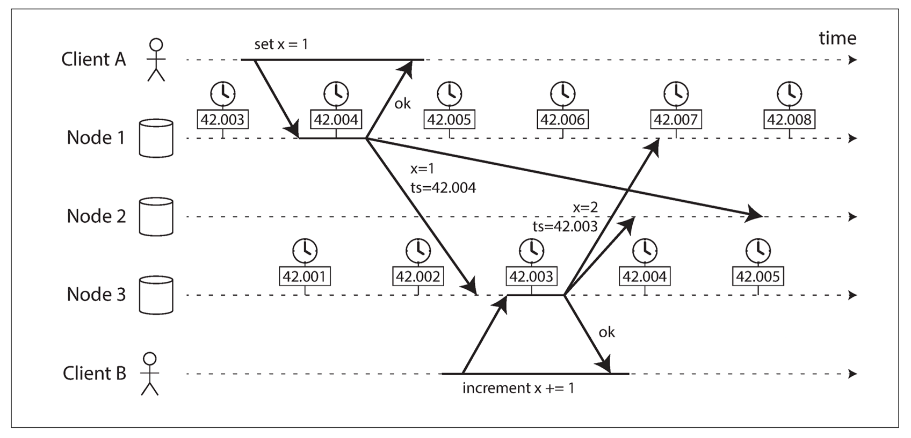

# 分布式系统中的物理时钟与因果一致性问题

## 1. 原问题
**下图展示了一个分布式系统中涉及多节点的写入操作及其时间戳管理的情况。**
**(1) 说明这种时间戳逆序现象可能带来的问题。**
**(2) 讨论如何通过因果一致性、全序广播等方式来解决上述问题。**

---

## 2. 相关考点
该问题深入探讨了分布式系统中的**时间和顺序（Time and Order）**，涉及以下核心考点：
* **物理时钟与时钟偏差（Clock Skew）**：NTP协议的局限性及不同机器间的时间差异。
* **最后写入者胜（LWW - Last Write Wins）**：基于时间戳解决冲突的机制及其缺陷。
* **逻辑时钟（Logical Clocks）**：Lamport时钟与向量时钟（Vector Clocks）。
* **一致性模型**：因果一致性（Causal Consistency）与线性一致性（Linearizability）。
* **全序广播（Total Order Broadcast）**：通过单点定序解决并发冲突。

---

## 3. 核心知识点讲解

### 3.1 问题分析：时间戳逆序带来的危害

从图 `image_5f02ae.png` 中我们可以观察到典型的**物理时钟不同步**现象：
1.  **场景描述**：
    * Client A 向 Node 1 发送 `set x = 1`。Node 1 在本地时间 **42.004** 处理该请求。
    * Client B 向 Node 3 发送 `increment x += 1`。Node 3 在本地时间 **42.003** 处理该请求。
2.  **时间戳逆序**：
    * 虽然在物理时间轴上（图中从左到右），Node 1 的操作似乎发生在 Node 3 之前或者同时，但 Node 3 的本地时钟（42.003）却滞后于 Node 1（42.004）。
3.  **导致的问题**：
    * **丢失更新（Lost Update）**：如果系统采用 **LWW（最后写入者胜）** 策略，即保留时间戳更大的数据。
        * Node 1 的写入时间是 42.004。
        * Node 3 的写入时间是 42.003。
        * 系统会判定 Node 1 的操作是“最新”的，从而覆盖掉 Node 3 的 `increment` 操作。最终结果是 $x=1$，而 Client B 的自增操作被丢弃了。
    * **因果违背**：如果 Client B 是在看到 Client A 的结果后才发起的 increment（图中未明确画出通信，但若存在因果关系），物理时钟的逆序会导致系统误判事件发生的先后顺序，破坏因果一致性。

### 3.2 解决方案：因果一致性与全序广播

为了解决物理时钟不可靠的问题，分布式系统通常引入逻辑上的顺序控制。

#### 1. 因果一致性 (Causal Consistency)
* **核心思想**：不再依赖不精准的物理时间，而是通过追踪**事件之间的依赖关系**来排序。如果事件 A “导致”了事件 B（A -> B），那么所有节点必须先看到 A，再看到 B。
* **实现方式**：使用**逻辑时钟**（如 Lamport Clocks 或 Vector Clocks）。
    * 每个请求不只携带物理时间，还携带一个逻辑计数器或向量版本号。
    * 如果 Client B 读取了 Node 1 的数据（$x=1$）然后发起 increment，它会将读取到的版本号包含在写请求中。
    * Node 3 收到请求后，会发现该请求依赖于版本 $V_{node1}$，从而强制将本地操作排在 Node 1 的操作之后，而不关心本地物理时间是 42.003 还是 42.005。

#### 2. 全序广播 (Total Order Broadcast)
* **核心思想**：通过一个全局的“定序器”或者共识协议，强制所有节点按照完全相同的顺序处理消息。
* **实现方式**：
    * **单点定序**：所有写请求（A 的 set 和 B 的 increment）都先发送给一个主节点（Leader）。主节点按接收顺序分配单调递增的序列号（ID=1, ID=2...）。Node 1 和 Node 3 必须按序列号执行。
    * **共识算法 (Paxos/Raft)**：利用 Raft log 的索引（Index），确保所有节点日志顺序一致。
* **解决效果**：在全序广播下，物理时间戳变得不再重要。系统只认序列号。如果 `set x=1` 被定序为 #5，`increment` 被定序为 #6，那么无论 Node 3 的物理时钟多慢，它都会先执行 #5 再执行 #6，保证最终结果正确 ($x=2$)。

---

## 4. 类似题目

1.  **题目一**：Google Spanner 数据库是如何利用 **TrueTime API** 解决物理时钟偏差问题的？
2.  **题目二**：**逻辑时钟（Lamport Clock）** 和 **向量时钟（Vector Clock）** 的主要区别是什么？为什么解决冲突时通常更倾向于用向量时钟？
3.  **题目三**：什么是 **NTP（Network Time Protocol）**？为什么在分布式强一致性系统中不能单纯依赖 NTP？

---

## 5. 对应的答案

### 答案一：Google Spanner 的 TrueTime
* **机制**：Spanner 不假定时钟是完美的，而是将时间视为一个区间 $[t_{earliest}, t_{latest}]$，并保证真实时间一定在这个区间内。区间的宽度（$\epsilon$）通常由原子钟和GPS控制在极小范围（如 7ms）。
* **提交等待**：在提交事务时，Spanner 会强制等待一段时间（$2\epsilon$），确保事务的时间戳 $T_{commit}$ 肯定已经过去了（即绝对早于现在的物理时间）。这保证了如果事务 $T_1$ 在物理上早于 $T_2$ 完成，那么 $T_1$ 的时间戳一定小于 $T_2$，实现了外部一致性（External Consistency）。

### 答案二：Lamport Clock vs Vector Clock
* **Lamport Clock**：
    * *结构*：每个节点维护一个整数计数器。
    * *能力*：能保证如果 $A \to B$（A 导致 B），则 $Clock(A) < Clock(B)$。
    * *缺点*：反之不成立。如果 $Clock(A) < Clock(B)$，不能确定 A 和 B 是因果关系还是并发关系。无法识别并发冲突。
* **Vector Clock**：
    * *结构*：每个节点维护一组计数器 $[v_1, v_2, ..., v_n]$，代表它所知道的其他节点的状态。
    * *能力*：能够通过对比向量关系（大于、小于、同时大于和小于），精确区分出两个事件是**因果相关**还是**并发冲突**。
    * *优势*：在类似 Dynamo 的系统中，向量时钟用于检测数据冲突（兄弟节点），允许客户端进行合并，而不是像 LWW 那样盲目覆盖。

### 答案三：NTP 的局限性
* **NTP**：通过网络同步计算机时钟的协议。
* **不可靠原因**：
    1.  **网络延迟**：网络包的传输时间是不确定的，导致同步精度通常在毫秒级（几十到几百毫秒），在跨数据中心时误差更大。
    2.  **石英钟漂移**：计算机本地晶振受温度影响会产生漂移（Drift）。
    3.  **跳变**：当时钟与服务器差异过大时，NTP 可能会强制“跳变”时间（突然向前或向后调整），这会导致测量到的时间段出现负数，对依赖单调时间的算法是致命的。

# 分布式写入中的时间戳逆序：风险与解决方案（因果一致性 / 全序广播）

## 1. 原问题
**下图展示了一个分布式系统中涉及多节点的写入操作及其时间戳管理的情况。**  
（1）说明这种时间戳逆序现象可能带来的问题。  
（2）讨论如何通过因果一致性、全序广播等方式来解决上述问题。

---

## 2. 相关考点
- **物理时钟/分布式时钟误差**：时钟漂移、NTP回拨、跨机房偏移
- **基于时间戳的并发控制**：Last-Write-Wins（LWW）、MVCC版本、写入冲突解决
- **一致性模型**：
  - 因果一致性（Causal Consistency）
  - 顺序/线性一致性（Sequential/Linearizability）
- **消息传播与排序**：
  - 因果广播（Causal Broadcast）
  - 全序广播（Total Order Broadcast / Atomic Broadcast）
- **实现机制**：Lamport Clock、Vector Clock、Hybrid Logical Clock（HLC）、共识协议（Raft/Paxos）
- **常见异常**：写丢失、读回退、违反因果、状态机发散

---

## 3. 知识点
- **时间戳逆序现象**：不同节点对事件打上的“时间戳”无法反映真实的因果/发生顺序；后发生的事件可能拥有更小的时间戳（或先发生事件时间戳更大）。
- **危险根源**：如果系统把“时间戳大小”当作“全局先后顺序”来做：
  - 冲突解决（LWW）
  - 版本裁决（选最大ts）
  - 日志排序与重放
  就可能做出错误决定。

---

## 4. 核心知识点讲解

### 4.1（1）时间戳逆序可能带来的问题
结合图中含义：Client A 在 Node1 写 `set x=1`，产生较大的时间戳（例如 ts=42.004）；Client B 在 Node3 做 `increment x += 1`，产生较小的时间戳（例如 ts=42.003），但从“真实先后/因果”看，两者可能存在依赖或至少需要一致排序。

时间戳逆序会带来以下典型问题：

#### 4.1.1 违反因果关系（Causality Violation）
- 如果 B 的操作（increment）是基于“看到 A 写入后的 x=1”再执行，那么 B **因果上依赖** A。
- 但时间戳逆序会让系统可能按 ts 排序为：`increment (ts=42.003)` 在 `set (ts=42.004)` 之前。
- 结果：其他节点可能先应用 increment，再应用 set，表现为“后因先果”，对外暴露出违反直觉的历史。

#### 4.1.2 冲突解决错误（LWW 导致写丢失/回滚）
很多系统采用 **Last-Write-Wins（按时间戳取最大）**：
- 若把“ts大”视为“更新更晚”，则当旧操作 ts 更大时，可能覆盖新操作。
- 具体后果：
  - **写丢失（Lost Update）**：increment 的效果被 set 覆盖，最终 x 可能变回 1，而不是预期的 2。
  - **状态回退（Regression）**：用户先看到 x=2，随后变回 x=1。

#### 4.1.3 副本状态发散（Replica Divergence）
- 不同节点接收消息顺序不同，若再叠加“按本地时间戳排序/裁决”，各副本可能得出不同最终值：
  - Node2 先收到 set（ts大）后收到 increment（ts小）→ 可能丢弃 increment
  - Node3 先执行 increment 后执行 set → 可能覆盖回 1
- 结果：**最终一致性无法收敛**，或收敛到非预期状态。

#### 4.1.4 破坏单调读/可重复读体验
- 客户端可能观察到：
  - 先读到更新后的值（x=2），再读到较旧的值（x=1）
- 这属于会话层面的“读回退”，对业务非常致命（尤其配置、权限、余额等）。

---

### 4.2（2）如何用因果一致性、全序广播等解决

> 解决思路的核心是：**不要用不可靠的物理时间戳去决定“全局顺序”**；而是用“因果关系”或“全局一致顺序”来约束副本应用顺序。

下面给出两类代表性方案：**因果一致性（只约束有依赖的顺序）** 与 **全序广播（对所有写入建立统一顺序）**。

---

## 4.2.1 方案一：因果一致性（Causal Consistency）

### A. 目标
保证：如果操作 B 因果依赖操作 A（A → B），那么任何节点都必须以 A 在前、B 在后的顺序观察/应用。

它不强制所有并发操作全局排序，只要求“有因果的必须一致”。

### B. 实现机制（典型做法）
1. **捕获依赖（Dependencies）**
   - 客户端在读取到某版本后，将该版本的“因果元数据”带到后续写请求中。
   - 元数据可用：
     - **向量时钟（Vector Clock）**：精确表达因果关系，但元数据随节点数增长
     - **Lamport Clock**：表达“可能先后”，不如向量精确
     - **HLC（Hybrid Logical Clock）**：结合物理时间与逻辑计数，缓解时钟问题并可表达因果单调性

2. **因果广播 / 依赖检查**
   - 副本接收到一个更新 U 时，若 U 声明依赖集合 D：
     - 若 D 中版本尚未在本地可见/已提交，则 **暂存等待**
     - 直到依赖满足才应用 U
   - 这样可避免“increment 先于 set 被应用”的情况（若 increment 依赖 set）。

### C. 例子（贴合图的解释）
- Client A 写 `set x=1`，产生版本 vA，并被 Client B 读取到。
- Client B 发起 `increment x+=1` 时，携带依赖：`deps = {vA}`
- 任意节点收到 increment 更新时，如果还没应用 vA，就先缓存；应用 vA 后再应用 increment。
- 即便物理时间戳出现 ts(increment) < ts(set)，也不会出现应用顺序颠倒导致的语义错误。

### D. 优缺点
- 优点：比强一致/全序更高性能、更高可用；满足“因果直觉”
- 缺点：需要维护依赖元数据与等待队列；对跨分区/多key事务支持更复杂；并发写仍可能需要冲突解决策略（例如CRDT或业务合并）

---

## 4.2.2 方案二：全序广播（Total Order Broadcast / Atomic Broadcast）

### A. 目标
保证：所有节点对所有更新以**完全相同的顺序**交付与应用。  
即使两个操作并发无因果，也会被强行排成同一个全局顺序。

这直接消除“不同节点看到不同顺序”与“按时间戳裁决”的问题。

### B. 实现机制（典型做法）
1. **通过共识协议确定全局顺序**
   - 将写入提交到一个复制日志（replicated log）中：
     - Raft/Paxos/基于leader的日志复制
   - Leader 为每个写入分配递增的 log index（或全局序号），并以多数派确认提交。

2. **所有节点按同一序号顺序应用**
   - 节点只按 log index 顺序执行更新，确保状态机复制（State Machine Replication, SMR）一致。
   - 物理时间戳仅作调试或过期判断，不参与“谁覆盖谁”的裁决。

### C. 例子（贴合图的解释）
- `set x=1` 被分配 index=100
- `increment x+=1` 被分配 index=101
- 所有节点严格按 100→101 应用，最终一致得到 x=2。
- 即使某节点本地时钟认为 increment 的时间戳更小，也不会影响应用顺序。

### D. 优缺点
- 优点：语义最强（接近线性一致/顺序一致），副本不发散，开发心智成本低
- 缺点：写入需要协调（共识、quorum），延迟和吞吐成本更高；分区时可用性受影响（CP倾向）

---

## 4.2.3 工程上常见的折中与补强（加分点）
1. **避免仅靠物理时钟的LWW**
   - 使用 **HLC** 替代纯物理时间，保证本地单调递增并能编码因果；减少回拨风险。
2. **特定数据类型用CRDT**
   - 对 `increment` 这类可交换/可合并操作，用 **G-Counter/PN-Counter** 等CRDT，避免因顺序差异导致写丢失。
3. **按对象/分区建立全序（Partition-level total order）**
   - 不做全局全序，而是对同一key或同一分区内建立全序（更可扩展），跨分区只保证因果或通过事务协议。

---

## 5. 类似题目
1. **题目一**：为什么仅靠NTP同步仍不能保证分布式系统中时间戳的正确排序？时钟回拨会造成什么后果？
2. **题目二**：Lamport Clock、Vector Clock、HLC分别解决什么问题？各自代价是什么？
3. **题目三**：对“计数器自增”场景，为什么CRDT往往比LWW更合适？请说明原因。

---

## 6. 对应的答案

### 答案一：时间戳逆序会导致什么问题
- 可能违反因果（先看到结果后看到原因）。
- 基于LWW的冲突解决会错误覆盖，造成写丢失/状态回退。
- 副本因接收顺序差异而发散，无法稳定收敛。
- 客户端观察到读回退，破坏单调读与业务逻辑正确性。

---

### 答案二：用因果一致性解决（举例）
- 写请求携带依赖（向量时钟/HLC）。
- 副本只有在依赖版本已可见时才交付该写入，否则暂存等待。
- 例如 increment 操作携带依赖 set 的版本号，任何节点都必须先应用 set 再应用 increment，从而避免逆序带来的覆盖与回退。

---

### 答案三：用全序广播解决（举例）
- 通过共识协议（Raft/Paxos）将所有写入进入统一复制日志，Leader分配全局递增序号。
- 所有节点严格按序号执行，得到一致状态。
- 例如 set 被排在 log index=100，increment 在 index=101，所有节点执行后最终一致为 x=2，不受物理时间戳逆序影响。
