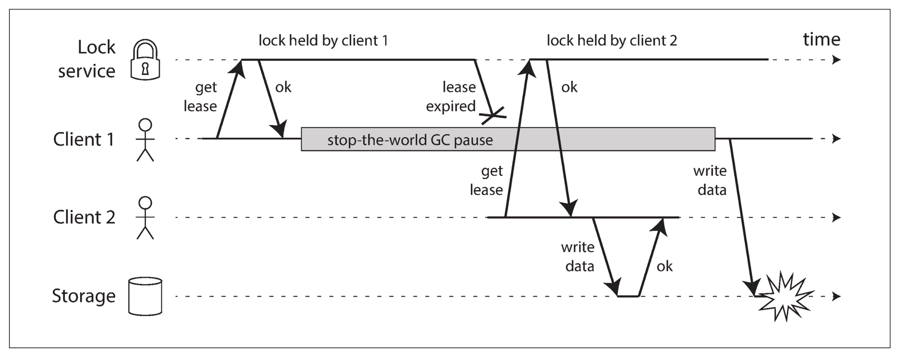

# 分布式锁失效：GC停顿与租约过期问题

## 1. 原问题
**下图展示了由于租约过期和客户端垃圾回收暂停导致的锁服务竞争问题。**
**(1) 说明图中展示的租约机制可能带来的问题。**
**(2) 为解决上述问题，试列举可能的解决方法，并简要说明其原理。**

---

## 2. 相关考点
在分布式系统、高并发架构及中间件设计的面试中，该图表（通常出自 Martin Kleppmann 对 Redlock 的分析或 DDIA 一书）是非常经典的案例，涉及以下考点：
* **分布式锁的安全性 (Safety)**：互斥性（Mutual Exclusion）如何在异常情况下保证。
* **“世界停止” (Stop-the-World) GC**：JVM垃圾回收对业务逻辑执行连续性的影响。
* **租约机制 (Lease)**：TTL（Time To Live）与心跳保活。
* **隔离令牌 (Fencing Token)**：如何防止“僵尸”进程污染数据。
* **乐观锁与版本控制**：CAS (Compare-And-Swap) 思想在存储层的应用。

---

## 3. 核心知识点讲解

### 3.1 图中展示的问题：锁失效与数据因果错乱
从图 `image_5f0611.jpg` 中我们可以清晰地看到分布式锁在不可靠的物理环境（进程暂停）下是如何失效的：

1.  **正常获取锁**：Client 1 从锁服务（Lock Service）成功获取了租约（Lease），开始执行任务。
2.  **不可控的停顿**：Client 1 遭遇了长时间的 **Stop-the-world GC pause**（垃圾回收停顿）。此时，Client 1 的所有线程挂起，时间对其来说是“静止”的，但墙上时钟（Wall-clock time）仍在流逝。
3.  **租约过期**：在 Client 1 沉睡期间，它持有的租约在锁服务处过期了。
4.  **锁被抢占**：Client 2 请求锁，锁服务发现此时无锁（旧锁已过期），于是将锁授予 Client 2。Client 2 正常写入数据到存储（Storage）。
5.  **僵尸写入（数据冲突）**：Client 1 的 GC 结束，线程苏醒。它**错误地认为**自己仍然持有锁（因为它不知道自己睡了多久）。于是它向 Storage 发起写操作，直接覆盖了 Client 2 刚刚写入的数据。
    * **后果**：打破了锁的互斥性，导致数据损坏或覆盖，即**脑裂（Split-Brain）**下的并发写入。

### 3.2 解决方法：隔离令牌 (Fencing Token)
为了解决这个问题，仅靠客户端自己检查锁是否过期是不够的（因为检查完的瞬间可能又发生 GC）。必须引入存储层面的校验。最经典的方案是 **Fencing Token**。

* **原理**：
    1.  **单调递增令牌**：锁服务在每次授予锁时，必须返回一个**单调递增**的数字（令牌），例如 `zk_id` 或 `version`。
        * Client 1 拿到令牌 `33`。
        * Client 2 拿到令牌 `34`（因为是后生成的）。
    2.  **存储层校验**：数据存储层（数据库/KV存储）需要记录下它所处理过的**最大令牌号**。
    3.  **拒绝旧令牌**：当 Client 1 苏醒后，带着令牌 `33` 去写数据。存储层发现自己已经处理过令牌 `34` 的写请求了，由于 $33 < 34$，存储层会**拒绝** Client 1 的请求。

### 3.3 其他辅助方案
* **看门狗机制 (Watchdog)**：如 Redisson 框架。开启一个后台线程，每隔一段时间自动给锁“续命”（延长 TTL）。这能防止非故障造成的超时，但如果 GC 停顿时间过长导致看门狗线程也挂起，依然可能出现图中的问题，因此 Fencing Token 才是兜底方案。

---

## 4. 类似题目

1.  **题目一**：Redis 的 **Redlock** 算法被批评不安全，主要原因是什么？与上图有何关系？
2.  **题目二**：在 Zookeeper 中，如何利用 **Zxid** 或版本号实现类似的 Fencing 机制？
3.  **题目三**：什么是 **CAS (Compare-And-Swap)**？它如何在不使用分布式锁的情况下解决并发写入问题？

---

## 5. 对应的答案

### 答案一：Redlock 的安全性争议
* **核心原因**：Redlock 强依赖**系统时钟**。算法假设不同机器的时钟偏差很小。
* **关系**：Redlock 并没有内置 Fencing Token 机制。如果发生上图中的 GC 停顿，或者服务器时钟发生跳变（Time Jump），Redlock 也会出现“一个客户端以为自己有锁，实际上锁已失效”的情况，从而导致资源并发冲突。这正是 Martin Kleppmann 批评 Redlock 的核心论据。

### 答案二：Zookeeper 的 Fencing 实现
* **机制**：Zookeeper 的节点具有 `cversion`（子节点版本）或 `czxid`（创建事务ID）。
* **实现**：
    * 客户端创建临时顺序节点（Sequential Ephemeral Node）。节点名称末尾的数字就是天然的单调递增 Token。
    * 客户端在操作数据库时携带这个数字。
    * 数据库执行 `UPDATE table SET val=x, ver=34 WHERE id=1 AND ver < 34`。如果受影响行数为 0，说明被更高版本的锁抢占了。

### 答案三：CAS (乐观锁)
* **定义**：比较并交换。操作时不上锁，而是在更新那一刻检查数据是否被修改过。
* **原理**：
    * 读取数据时，同时读出版本号 `v1`。
    * 计算新值。
    * 写入时，条件是 `WHERE version = v1`。
    * 如果写入失败（说明中间有人改过，版本变成了 `v2`），则重试。
* **区别**：上图是“悲观锁”（先加锁再做事）失效的场景；CAS 是“乐观锁”方案，它天生就能解决上图中的覆盖问题，因为 Client 1 苏醒后版本号校验会失败。
# 租约锁在GC暂停下的竞争问题：风险与解决方案

## 1. 原问题
**下图展示了由于租约过期和客户端垃圾回收暂停导致的锁服务竞争问题。**  
（1）说明图中展示的租约机制可能带来的问题。  
（2）为解决上述问题，试列举可能的解决方法，并简要说明其原理。

---

## 2. 相关考点
- **分布式锁/租约（Lease）语义**：互斥性、安全性（Safety）与活性（Liveness）
- **时钟与超时的不确定性**：GC Stop-the-world、线程暂停、调度延迟、网络抖动
- **锁服务的失效模式**：脑裂/双主（split-brain）、锁漂移（lock drift）
- **Fencing Token（栅栏令牌）**：防止过期持锁者继续写
- **锁续约与心跳**：renew/keepalive，超时与降级策略
- **一致性与线性化**：锁服务的线性一致实现（ZK/etcd/Consul）
- **存储侧保护**：幂等写、版本检查、CAS、事务/条件写

---

## 3. 知识点
- **租约锁**：锁不是永久持有，而是在“租期（TTL）”内有效；持有者需在到期前续租，否则锁服务可将锁授予其他客户端。
- **图中关键事件**：
  - Client1 获得锁（租约）。
  - Client1 发生 **stop-the-world GC pause**，导致无法续租/无法按时释放锁。
  - 租约在锁服务端看来已过期，锁被授予 Client2。
  - Client2 在持锁状态写入存储成功。
  - Client1 GC恢复后 **误以为自己仍持锁**，继续写入导致冲突/数据损坏（图中爆炸）。

---

## 4. 核心知识点讲解

### 4.1（1）该租约机制可能带来的问题
#### 4.1.1 互斥性被破坏（双持锁/双写，Split-Brain）
- 租约到期后锁被转授给 Client2，但 Client1 由于暂停恢复后继续执行临界区逻辑。
- 结果是**两个客户端都在“认为自己持锁”的状态下操作共享资源**，出现双主/双写。

#### 4.1.2 数据一致性/正确性风险（最严重）
- 典型后果：
  - **写覆盖**：Client1 的旧写覆盖 Client2 的新写。
  - **交错写导致状态机破坏**：例如“先扣库存后生成订单”被并发交错，造成账实不符。
  - **不可恢复的数据损坏**：尤其是对外部存储（对象存储、文件系统、非事务KV）执行非幂等写操作时。

#### 4.1.3 锁语义与业务语义不一致（“锁在服务端过期”≠“客户端停止执行”）
- 锁服务只能基于超时/心跳判断“租约是否有效”，但无法保证客户端在租约失效后立刻停止临界区。
- GC暂停、进程hang、内核调度延迟会使“客户端实际停止时间”不可控，从而产生**锁漂移（lease/lock drift）**问题。

#### 4.1.4 仅依赖客户端本地时间/超时的风险
- 若客户端用本地时钟判断“租约尚未过期”也会出错（时钟跳变、暂停、NTP回拨）。
- 本质：**时间不是可靠的故障检测信号**，尤其在长尾暂停存在时。

---

### 4.2（2）解决方法与原理（列举方案）

> 结论先行：要从根上解决图中问题，不能只“把TTL调大”，而应引入**失效持锁者的写入隔离（fencing）**或**在资源侧做条件写**，使得“过期持锁者即使继续运行也无法造成破坏”。

下面给出常见可落地方案。

---

#### 方案A：Fencing Token（栅栏令牌）——最推荐
**原理**
- 每次成功获取锁时，锁服务返回一个**单调递增的令牌**（token/epoch/sequence）。
- 客户端对共享资源的任何写操作，必须携带该 token。
- 存储/资源侧维护“当前最大token”，只接受 **token 更大** 的写；旧token写直接拒绝。

**为什么能解决**
- 即使 Client1 过期后恢复继续写，它携带的 token 比 Client2 小，写入会被存储拒绝，从而避免数据损坏。

**实现要点**
- 锁服务：获取锁返回 `{owner, lease_expiry, fencing_token++}`
- 存储侧：`if token <= last_token: reject; else accept & update last_token`
- 适用于：数据库条件更新（CAS/compare-and-set）、带版本号写、对象存储元数据校验等。

---

#### 方案B：资源侧条件写 / CAS / 事务（把“互斥”下沉到存储）
**原理**
- 不完全依赖锁服务做互斥，而是在存储层用原子条件更新保证安全：
  - `UPDATE ... WHERE version = old_version`
  - `PUT(key, value) only_if(etag matches)`
  - 事务/行锁等

**为什么能解决**
- 即便客户端并发进入临界区，最终只有满足条件的写能成功，从而避免错误覆盖。

**适用**
- 资源本身支持事务或条件写的场景（RDBMS、支持CAS的KV、支持ETag的对象存储）。

---

#### 方案C：租约续约（KeepAlive）+ “失效即停机”（Fail Fast / Self-Fencing）
**原理**
- 客户端必须周期续约；一旦续约失败或检测到租约已失效：
  - 立即停止对共享资源的操作（退出进程/隔离线程/进入只读模式）
  - 或触发“自我隔离（self-fencing）”动作，例如让容器被K8s杀掉重启。

**为什么能缓解**
- 能减少“过期持锁者继续写”的概率。
- 但注意：它依赖客户端能及时检测并执行停止动作；在GC暂停这种情形下，恢复后仍可能已经做了破坏性操作，因此**单靠该方案不如Fencing可靠**。

---

#### 方案D：延长TTL + 续约保护窗口（仅缓解，不治本）
**原理**
- 增加租期，让常见GC暂停不至于超过TTL；或根据观测到的99.99%暂停时长设定TTL。
- 有时配合“续约提前量”（提前很久续租）减少到期风险。

**缺点（必须说明）**
- 不能从理论上保证安全：只要存在更长暂停，就仍可能发生双写。
- TTL越大，故障切换越慢（影响可用性与恢复时间）。

---

#### 方案E：使用线性一致的协调服务实现锁（etcd/ZooKeeper）+ 临时节点/会话
**原理**
- 锁服务本身必须是线性一致（避免服务端自身产生双主发锁）。
- 例如：
  - ZooKeeper：临时节点 + 会话（session）断开自动删除节点
  - etcd：lease + keepalive
- 这能保证“锁授予顺序”正确。

**注意**
- 这解决的是“锁服务自身不一致导致双发锁”的问题；但**仍不能阻止**图中“客户端暂停后继续写”的本质风险。
- 因此通常仍需与 **Fencing Token** 或资源侧条件写结合。

---

#### 方案F：将“锁”升级为“主从任期/epoch”机制（Leader Epoch）
**原理**
- 将持锁者视为“主”，主有 epoch/term。
- 任何对外写必须带 epoch，资源侧只认最新 epoch。
- 与 fencing 类似，但语义更偏“主权切换”。

**适用**
- 主从切换、主写副本、任务调度主控等场景。

---

## 5. 类似题目
1. **题目一**：为什么“把锁TTL设得更长”不能从根本上解决租约锁问题？它会带来哪些副作用？
2. **题目二**：什么是 fencing token？它与“可重入锁/续租”相比解决的核心问题是什么？
3. **题目三**：在Kubernetes中如何实现 leader election？如何防止旧leader恢复后继续执行任务（fencing思路）？

---

## 6. 对应的答案

### 答案一：（1）租约机制带来的问题
- GC暂停导致客户端无法续租，锁在服务端过期并被授予新客户端。
- 旧客户端恢复后仍继续执行临界区，产生“双持锁/双写”（互斥性被破坏）。
- 最终可能造成写覆盖、状态回退、不可恢复的数据损坏；本质是“锁过期不等于客户端停止”。

---

### 答案二：（2）解决方法与原理（举例）
1. **Fencing Token（最推荐）**
   - 获取锁返回递增token；写入必须携带token；存储拒绝旧token写，避免过期持锁者破坏数据。
2. **资源侧条件写/CAS/事务**
   - 通过版本检查或事务把并发控制下沉到存储层，避免错误覆盖。
3. **续约+失效即停机（自我隔离）**
   - 续约失败立即停止或重启进程，降低旧持锁者继续写的概率（但不如fencing绝对安全）。
4. **线性一致锁服务（etcd/ZK）**
   - 保证锁授予顺序正确，避免锁服务自身双发锁；通常需与fencing结合才能彻底解决图中问题。
