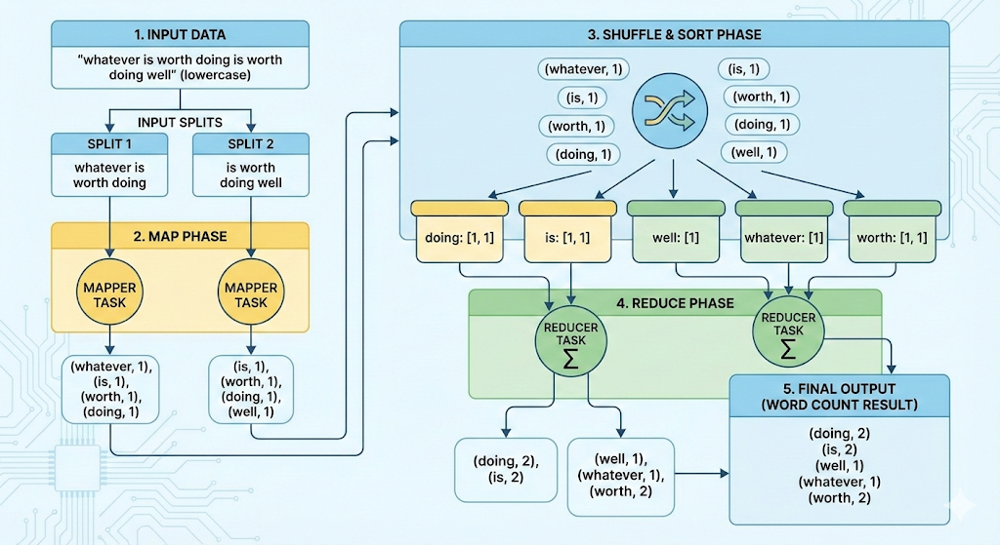
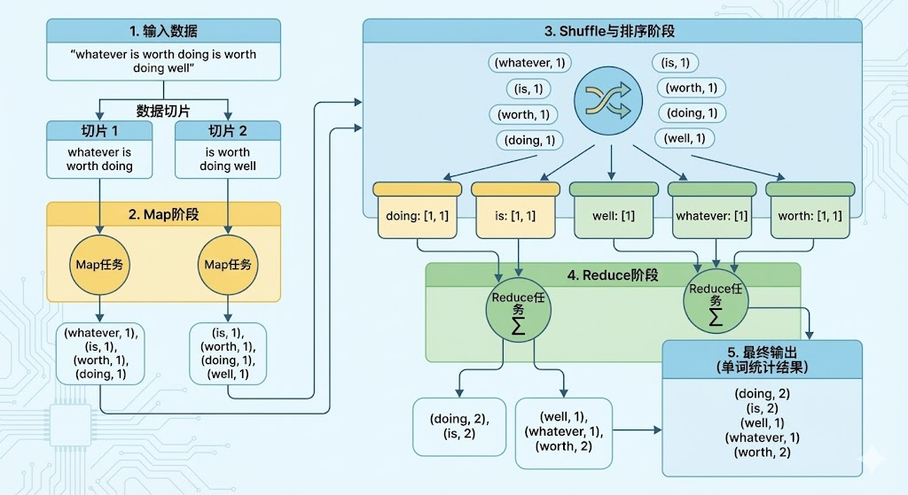

# MapReduce 数据处理流程与单词统计图解

## 1. 原问题
**简述MapReduce数据处理流程，并试画出使用MapReduce来对英语句子“Whatever is worth doing is worth doing well”进行单词统计的过程。**

---

## 2. 相关考点
MapReduce 是大数据处理的基石（尽管现在常被 Spark 取代，但思想一致），面试核心考点包括：
* **核心阶段**：Split（分片）、Map（映射）、Shuffle（洗牌）、Reduce（归约）。
* **Shuffle 机制**：这是最复杂的环节，涉及 Partition（分区）、Sort（排序）、Spill（溢写）、Merge（合并）。
* **Combiner 的作用**：在 Map 端预聚合，减少网络传输。
* **数据本地性 (Data Locality)**：计算向数据移动。
* **键值对设计**：如何将复杂业务逻辑转化为 `<Key, Value>` 模型。

---

## 3. 核心知识点讲解

### 3.1 MapReduce 通用流程
MapReduce 采用“分而治之”的思想，将大规模数据计算分为两个主要阶段：Map（映射）和 Reduce（归约）。

1.  **Input Split (输入分片)**：将大文件切割成若干个 Split（通常对应 HDFS 的 Block 大小），每个 Split 启动一个 Map Task。
2.  **Map 阶段**：解析输入数据，将其转化为 `<Key, Value>` 对。
3.  **Shuffle 阶段 (核心)**：
    * **Partition**：决定数据发往哪个 Reducer。
    * **Sort**：对 Key 进行排序。
    * **Group**：将相同 Key 的 Value 聚合在一起，形成 `<Key, List(Values)>`。
4.  **Reduce 阶段**：接收 Shuffle 过来的数据，对每个 Key 对应的 `List(Values)` 进行汇总计算，输出最终结果。
5.  **Output**：将结果写入文件系统（如 HDFS）。

### 3.2 单词统计 (Word Count) 过程演示
针对句子：**"Whatever is worth doing is worth doing well"**

假设我们需要统计单词出现的频率（不区分大小写，去掉标点）。流程如下：

#### Step 1: Input (输入)
原始数据：
`"Whatever is worth doing is worth doing well"`

#### Step 2: Map (映射)
Map 函数逐个读取单词，输出 `<单词, 1>`。
*(注：这里为了严谨，通常会进行小写标准化)*

| Key | Value |
| :--- | :--- |
| whatever | 1 |
| is | 1 |
| worth | 1 |
| doing | 1 |
| is | 1 |
| worth | 1 |
| doing | 1 |
| well | 1 |

#### Step 3: Shuffle (洗牌 - 排序与分组)
系统根据 Key 进行排序，并将相同的 Key 合并。
输入给 Reducer 的数据格式变为 `<Key, List(Value)>`。

| Key | List(Values) |
| :--- | :--- |
| **doing** | `[1, 1]` |
| **is** | `[1, 1]` |
| **well** | `[1]` |
| **whatever** | `[1]` |
| **worth** | `[1, 1]` |

#### Step 4: Reduce (归约)
Reduce 函数对 Value 列表进行求和：`sum(List)`。

| Key | Final Value |
| :--- | :--- |
| **doing** | **2** |
| **is** | **2** |
| **well** | **1** |
| **whatever** | **1** |
| **worth** | **2** |

---

## 4. 类似题目

1.  **题目一**：MapReduce 中 **Shuffle** 阶段具体包含了哪些操作？为什么说它是性能瓶颈？
2.  **题目二**：什么是 **Combiner**？它与 Reducer 有什么区别？什么情况下不能使用 Combiner？
3.  **题目三**：如果 Reduce 端出现严重的**数据倾斜**（某个 Key 的数据量远超其他 Key），应该如何解决？

---

## 5. 对应的答案

### 答案一：Shuffle 阶段详解
* **操作**：Shuffle 连接了 Map 和 Reduce。
    * *Map 端*：Partition（分区）、Spill（写入环形缓冲区并溢写到磁盘）、Sort（对 Key 排序）、Merge（合并溢写文件）。
    * *Reduce 端*：Fetch（拉取数据）、Merge（归并排序）。
* **性能瓶颈原因**：
    * 涉及大量的**磁盘 I/O**（频繁读写临时文件）。
    * 涉及大量的**网络 I/O**（跨节点传输数据）。
    * 涉及大量的**CPU 消耗**（排序和序列化/反序列化）。

### 答案二：Combiner 的作用与区别
* **定义**：Combiner 是运行在 Map 端的“Mini Reducer”。
* **作用**：在 Map 任务结束前，先对本地产生的中间结果进行局部聚合（如先算出本地有 100 个 "the"），从而**减少网络传输量**和 Reducer 的负载。
* **区别**：Combiner 在 Map 节点运行，Reducer 在 Reduce 节点运行。
* **禁用场景**：当聚合操作**不满足结合律**或**交换律**时不能用。例如求**平均值 (Average)**。
    * *例子*：Map1 结果 (10, 20)，Map2 结果 (30, 40)。
    * *直接 Reduce*：Avg(10, 20, 30, 40) = 25。
    * *用 Combiner*：Map1 Avg=15, Map2 Avg=35 -> Reduce Avg(15, 35) = 25 (巧合对)。但如果数量不对等，如 Map1(10), Map2(20, 30, 40)，Combiner 后是 Avg(10)=10, Avg(20,30,40)=30，最后 Reduce Avg(10, 30)=20。而真实 Avg(10,20,30,40)=25。结果错误。

### 答案三：数据倾斜解决方案
* **现象**：程序进度卡在 99%，因为这就剩这一个处理大量数据的 Reducer 在跑。
* **方案**：
    1.  **Combiner**：在 Map 端先进行大量聚合，减少传输给 Reducer 的数据量。
    2.  **加盐 (Salting)**：给倾斜的 Key 加上随机前缀（如 `Key_1`, `Key_2`...），将其分散到不同的 Reducer 进行局部聚合；然后去掉前缀，再进行一次全局聚合（**两阶段聚合**）。
    3.  **自定义 Partitioner**：调整分区策略，避免将大 Key 分配到同一个节点（不常用，容易导致其他不均）。

  # MapReduce数据处理流程与词频统计示例

## 1. 原问题
**简述 MapReduce 数据处理流程，并描述使用 MapReduce 对英语句子 “Whatever is worth doing is worth doing well” 进行单词统计的过程。**

---

## 2. 相关考点
在面试或考试中，该问题通常覆盖以下核心考点：
- **MapReduce 编程模型**：Map、Shuffle/Sort、Reduce 各阶段职责与输入输出形式（KV）。
- **数据流与执行流程**：InputSplit、RecordReader、Mapper 输出、Partitioner、Combiner（可选）、Reducer、OutputFormat。
- **WordCount 经典范式**：tokenize、标准化（大小写/标点处理）、(word,1) 发射、按 key 聚合、求和输出。
- **Shuffle/Sort 机制理解**：分区（partition）决定 Reducer 去向；排序保证同 key 相邻；分组后进入 reduce。
- **性能与正确性细节**：Combiner 是否可用（需满足交换律/结合律）、数据倾斜、网络开销、序列化与压缩。

---

## 3. 核心知识点讲解

### 3.1 MapReduce 的整体数据处理流程（从输入到输出）
MapReduce 用于在分布式环境下进行大规模数据的并行处理，其核心流程可概括为：

1. **Input（输入阶段）**
   - **InputFormat** 将输入数据切分为多个 **InputSplit**（逻辑切片）。
   - **RecordReader** 将 Split 转成 Mapper 可读的记录，典型形式是：
     - Key：偏移量（offset）或记录标识
     - Value：一行文本（line）

2. **Map（映射阶段）**
   - Mapper 对每条记录做转换/抽取，输出一组中间键值对：
     - `map(k1, v1) -> list(k2, v2)`
   - 典型 WordCount：对文本分词后输出 `(word, 1)`。

3. **Shuffle/Sort（洗牌与排序阶段，框架核心）**
   - **Partitioner**：按 key 决定该键值对发送到哪个 Reducer（常见为 hash(key) % numReducers）。
   - **Shuffle**：跨节点拉取数据（网络传输），把相同 key 的数据汇聚到同一 Reducer。
   - **Sort/Group**：对 key 排序并分组，保证 Reducer 处理时拿到 `(key, [v2...])` 的形式。
   - **Combiner（可选）**：在 Map 端对同 key 做局部聚合，减少网络传输（WordCount 求和适用）。

4. **Reduce（归约阶段）**
   - Reducer 对同一 key 的 value 列表做聚合：
     - `reduce(k2, list(v2)) -> list(k3, v3)`
   - WordCount：对 `[1,1,1...]` 求和输出 `(word, count)`。

5. **Output（输出阶段）**
   - **OutputFormat/RecordWriter** 将 Reducer 结果写入分布式存储（如 HDFS），通常每个 Reducer 产出一个结果文件分片。

---

### 3.2 使用 MapReduce 对句子进行单词统计（WordCount 过程拆解）
目标句子：
> “Whatever is worth doing is worth doing well”

#### Step A：输入记录（示例）
假设该句子作为一行文本输入：
- 输入 Key（offset）：`0`（示例）
- 输入 Value（line）：`Whatever is worth doing is worth doing well`

#### Step B：Map 阶段（分词与发射）
Mapper 做两类常见预处理（面试可主动说明你假设的规范）：
- **大小写标准化**：将 `Whatever` 转为 `whatever`（可选但常见）
- **标点处理**：本句无标点，若有则剔除或替换为空格

分词结果（token list）：
- `whatever`, `is`, `worth`, `doing`, `is`, `worth`, `doing`, `well`

Mapper 输出（中间 KV）：
- `(whatever, 1)`
- `(is, 1)`
- `(worth, 1)`
- `(doing, 1)`
- `(is, 1)`
- `(worth, 1)`
- `(doing, 1)`
- `(well, 1)`

> 若不做大小写标准化，则 key 为 `Whatever`；统计逻辑不变，只是 key 不同。

#### Step C：Shuffle/Sort 阶段（按 key 聚合）
框架将相同 key 的 value 汇聚为：
- `whatever -> [1]`
- `is -> [1, 1]`
- `worth -> [1, 1]`
- `doing -> [1, 1]`
- `well -> [1]`

（排序通常会让 key 按字典序排列后再送入 Reducer，这属于框架细节。）

#### Step D：Reduce 阶段（求和输出）
Reducer 对每个 key 的 value 列表求和：
- `reduce(whatever, [1]) = 1`
- `reduce(is, [1,1]) = 2`
- `reduce(worth, [1,1]) = 2`
- `reduce(doing, [1,1]) = 2`
- `reduce(well, [1]) = 1`

最终输出（词频统计结果）：

| word      | count |
|----------|-------|
| whatever | 1     |
| is       | 2     |
| worth    | 2     |
| doing    | 2     |
| well     | 1     |

---

## 4. 类似题目
1. **题目一**：请描述如何用 MapReduce 计算一批整数的“平均值”（average），并说明为什么需要输出两个中间量而不是直接输出平均值。
2. **题目二**：请描述如何用 MapReduce 构建倒排索引（Inverted Index）：给定多篇文档，输出每个单词出现在哪些文档中及出现次数。
3. **题目三**：请描述如何用 MapReduce 统计“Top-K 高频词”（例如 Top-10），并说明常见的两阶段实现思路。

---

## 5. 对应的答案

### 答案一：MapReduce 计算平均值
**核心思路**：平均值 = 总和 / 总数。Map 阶段无法全局得知总数与总和，因此需要先聚合出两个量再计算。
- **Map 输出**：对每个数字 `x` 输出 `(key="all", (sum=x, count=1))`
- **Combiner（可选）**：局部把多个 `(sum, count)` 相加，减少网络传输
- **Reduce 输入**：`all -> [(s1,c1), (s2,c2), ...]`
- **Reduce 输出**：
  - `totalSum = Σ si`
  - `totalCount = Σ ci`
  - `avg = totalSum / totalCount`
  - 输出 `(avg)`

**为什么不是直接输出 avg？**
- avg 不满足可直接“分布式可合并”的简单聚合：你不能把两个局部 avg 简单再平均得到全局 avg（除非再带上权重），因此必须携带 `(sum,count)` 这类可结合的中间状态。

---

### 答案二：MapReduce 构建倒排索引（Inverted Index）
假设输入为多篇文档（docId, content）。

- **Map 阶段**：
  - 对每篇文档分词
  - 输出 `((word, docId), 1)` 或 `(word, docId)` 计数形式更常见为：
    - `(key=(word, docId), value=1)`

- **Shuffle/Sort**：
  - 按 `(word, docId)` 聚合，得到每个词在每篇文档的出现次数

- **Reduce 阶段（第一轮 Reduce）**：
  - 输出 `(word, (docId, tf))`

- **（可选第二轮）按 word 汇总成列表**：
  - Map：把 `(word, (docId, tf))` 原样输出
  - Reduce：对同一个 word 收集所有 `(docId, tf)`，输出：
    - `word -> [(doc1, tf1), (doc2, tf2), ...]`

---

### 答案三：MapReduce 统计 Top-K 高频词（两阶段常见实现）
**阶段 1：全量词频（WordCount）**
- Map：`(word, 1)`
- Reduce：`(word, totalCount)`

**阶段 2：Top-K 选取**
常见两种方式：

1) **全局 Top-K（推荐叙述）**
- Map：读取 `(word, count)`，在每个 Mapper 内维护一个大小为 K 的最小堆（或排序容器），得到本地 Top-K
- Reduce：收集所有 Mapper 的本地 Top-K（最多 M*K 条），再次用最小堆合并得到全局 Top-K

2) **利用排序与单 Reducer（不够弹性但好理解）**
- Map：把 key 设为 `count`（或 `(-count)`），value 为 word
- Shuffle：按 count 排序
- Reduce：如果只有一个 Reducer，顺序读入即可取前 K
- 缺点：单点瓶颈，扩展性差

结论：工程上常用“先计数，再局部 Top-K，再全局合并”的两阶段方案，兼顾正确性与扩展性。
